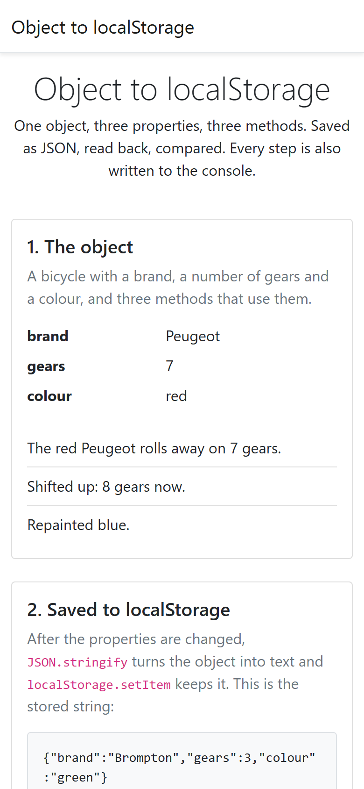

# object-to-localstorage

What does a JavaScript object keep when it goes through `localStorage`, and
what does it lose? One object with three properties and three methods is
built, used, changed, saved as JSON, read back and compared, on the page and
in the console.

HTML, Bootstrap for the layout, and vanilla JavaScript. No build step, no
JavaScript library: open the file and open the console.

## Screenshots

## How it works

**Three properties, three methods, one literal.** `bicycle` is an object
literal with `brand`, `gears` and `colour`, and three methods that read or
change them: `ride`, `shiftUp` and `repaint`. Each property is logged, each
method is called and its result logged, then the three properties get new
values and are logged again.

**Saving is `JSON.stringify` then `setItem`.** The string that lands in
`localStorage` is shown on the page exactly as stored. It carries the three
properties and nothing else: JSON has no representation for a function, so
the methods are dropped silently on the way out.

**Reading back is `getItem` then `JSON.parse`.** The result is a new object
with the same three properties and the values they had when saved. The page
checks `typeof restored.ride` and reports that the methods did not survive,
which is the whole point of the page.

**The page never writes HTML from strings.** Every list is built with
`createElement` and `textContent`, so nothing that comes out of storage can
be interpreted as markup.

## Running it

Open `index.html` in a browser, and open the developer console to follow the
same steps there. Reload to run the round trip again.

## Stack

HTML, Bootstrap 5.1 for the layout, and vanilla JavaScript. One script, no
stylesheet of its own, no JavaScript library.

## Résumé

Un objet JavaScript, trois propriétés et trois méthodes, qui traverse
`localStorage` : construit, utilisé, modifié, enregistré par `JSON.stringify`
et `setItem`, relu par `getItem` et `JSON.parse`, puis comparé, sur la page
et dans la console. La chaîne enregistrée est montrée telle quelle : elle
porte les trois propriétés et rien d'autre, le JSON n'ayant aucune façon de
représenter une fonction. L'objet relu retrouve ses propriétés et non ses
méthodes, ce que la page constate en vérifiant `typeof`. Rien n'est écrit
dans la page à partir de chaînes : listes construites par `createElement` et
`textContent`.

## Licence

MIT. See [LICENSE](LICENSE).
